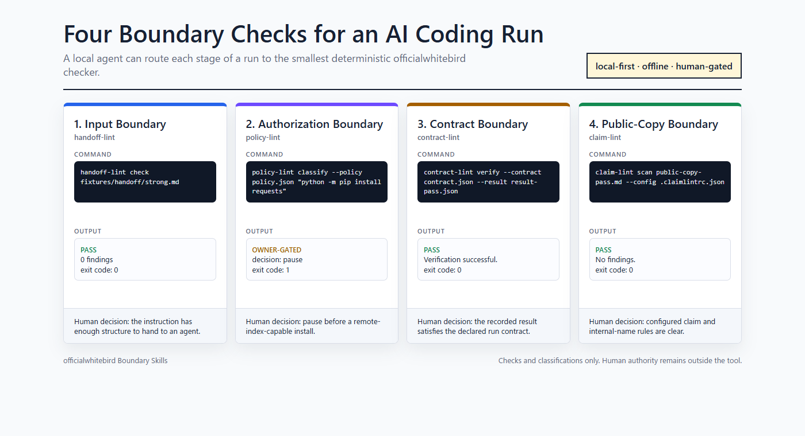

# officialwhitebird Boundary Skills

Agent-facing skill pack for checking AI-run boundaries with local officialwhitebird CLI tools.



## What This Checks

AI coding runs have four practical boundaries:

| Boundary | Tool | Question |
|---|---|---|
| Input | handoff-lint | Is the work instruction structurally complete? |
| Execution contract | contract-lint | Did the result satisfy the declared contract? |
| Execution authorization | policy-lint | Is this command allowed, owner-gated, or rejected? |
| Public copy | claim-lint | Does the README or release copy contain configured claim or internal-name findings? |

This repo does not add a new lint engine. It packages the four existing local CLIs into one agent-readable workflow.

## 30-Second Walkthrough

Ask your coding agent:

```text
Use officialwhitebird Boundary Skills to audit this run package.
```

The skill routes each boundary to the matching CLI:

```bash
handoff-lint check fixtures/handoff/strong.md
policy-lint classify --policy fixtures/policy/policy.json "git status --short"
contract-lint verify --contract fixtures/contract/contract.json --result fixtures/contract/result-pass.json --base-dir fixtures/contract
claim-lint scan fixtures/claims/public-copy-pass.md --config fixtures/claims/.claimlintrc.json
```

Expected summary:

```text
handoff: pass
command policy: allow
contract: pass
claims: pass
```

For local development without installing console scripts, run the bundled case study from this repository:

```powershell
powershell -ExecutionPolicy Bypass -File scripts/run-case-study.ps1
```

The script calls the sibling local repositories directly through `python -m` and checks both pass and expected-finding examples.

## Installation

### Manual skill use

After the GitHub repository exists, clone it and point your coding agent at `SKILL.md`.

```bash
git clone https://github.com/officialwhitebird/officialwhitebird-boundary-skills.git
```

For pre-publication local review, use this checkout directly and run:

```powershell
powershell -ExecutionPolicy Bypass -File scripts/run-case-study.ps1
```

The underlying CLI tools must also be available locally:

```bash
pip install git+https://github.com/officialwhitebird/handoff-lint.git
pip install git+https://github.com/officialwhitebird/contract-lint.git
pip install git+https://github.com/officialwhitebird/policy-lint.git
pip install git+https://github.com/officialwhitebird/claim-lint.git
```

For local development from sibling checkouts, see `references/underlying-cli-install.md`.

### Other local coding agents

Ask the agent to read this repository and start from `SKILL.md`. The skill uses local files and local CLI commands.

## Usage

### Audit a work instruction

```text
Audit this handoff before I send it to an agent.
```

The skill runs:

```bash
handoff-lint check instruction.md
```

### Classify a command

```text
Classify this command against policy.json before execution.
```

The skill runs:

```bash
policy-lint classify --policy policy.json "python -m pip install requests"
```

### Verify a run result

```text
Verify this result.json against contract.json.
```

The skill runs:

```bash
contract-lint verify --contract contract.json --result result.json
```

### Scan public copy

```text
Scan this README before publication.
```

The skill runs:

```bash
claim-lint scan README.md --config .claimlintrc.json
```

## Case Study Files

The `fixtures/` directory contains a small, generic run package:

- `fixtures/handoff/strong.md` and `fixtures/handoff/weak.md`
- `fixtures/policy/policy.json`
- `fixtures/contract/contract.json`, `result-pass.json`, and `result-fail.json`
- `fixtures/claims/public-copy-pass.md`, `public-copy-fail.md`, and `.claimlintrc.json`

The visual version is `docs/boundary-case-study.html`.

## What It Does Not Do

- It does not execute an AI coding run.
- It does not enforce sandboxing or security policy.
- It does not prove semantic correctness.
- It does not replace human approval for external, paid, destructive, or public actions.
- It does not send files to a hosted service.

## Status

Publish-ready local package. Publishing, pushing, profile updates, and public posts remain owner-gated.

## License

MIT.
